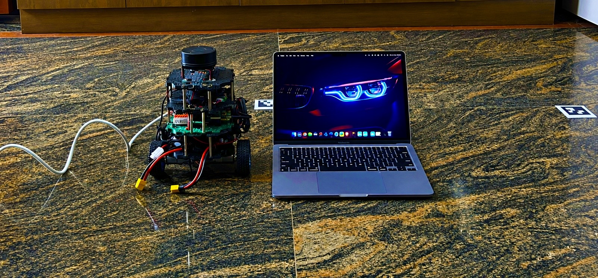
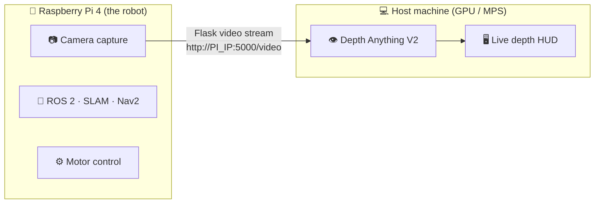

  echo "STOP: could not clone https://github.com/$OWNER/$REPO, check the owner and repo name"
else
cd ss-edit
cat > README.md <<'EOF'
<div align="center">



# 🕷️ SENTINEL-SLAM

### A LiDAR-mapping robot that also sees depth through a plain webcam.
**No LiDAR needed for that part.**


</div>

---

Most SLAM robots stop at "here's the map." This one also runs a **real-time
monocular depth estimation pipeline** alongside the mapping stack, and can
find its way back home using **ArUco markers** if it ever loses track of where
it is. Built, broken, and rebuilt with a small team over way too many late
nights debugging a fried WiFi chip.

## 🎯 Why this exists

We wanted a robot that didn't just map a room. It should *understand* how
far things are, live, from a single cheap camera. Stereo rigs and depth
cameras are expensive and finicky. So instead: LiDAR handles the mapping,
and a separate depth model (Depth Anything V2) running on a beefier machine
handles per-pixel depth in real time, streamed live off the robot.

## ⚡ What it actually does

| | Feature | Details |
| --- | --- | --- |
| 🗺️ | **Live SLAM + navigation** | `slam_toolbox` + Nav2 build and update an occupancy grid as the robot explores, with loop closure and autonomous exploration, all watchable in RViz |
| 🎯 | **IMU sensor fusion** | The map used to warp because of how the LiDAR was mounted. Fixed it by fusing IMU data in |
| 👁️ | **Real-time monocular depth** | Depth Anything V2 chews on a live camera feed and spits out a color-mapped depth overlay at ~35-40 FPS, running on a GPU/MPS host so the Pi doesn't choke |
| 📍 | **ArUco relocalization** | Lose tracking, spot a marker, and the robot re-anchors itself on the map instead of being lost forever |
| 🎮 | **Manual override** | Drive it straight from the keyboard when you just want to mess around |

## 🧠 How it's wired together

The Raspberry Pi is the workhorse for control: camera capture, the full ROS 2
stack, SLAM, Nav2 and motors. But depth models are hungry, and the Pi doesn't
have the muscle for real-time inference. So the camera feed gets streamed off
the Pi over Flask, and a separate host machine with a real GPU does the depth
math and renders the HUD.



## 🔩 Hardware components

| Component | Purpose |
| --- | --- |
| Raspberry Pi 4 | Onboard compute, ROS 2 nodes, motor control |
| RPLiDAR A1 (12m range) | Environment scanning for SLAM |
| MPU6050 IMU | Orientation feedback, sensor fusion |
| Zebronics Webcam | Camera feed for monocular depth estimation |
| 25GA-370 DC Geared Motor with Encoder | Drive motors with encoder feedback for odometry |
| Arduino Nano / L298N | Motor driver interface |
| WAGO 221-Series Lever Connectors (5-way) | Wiring connections between components |
| Bonka 2200mAh 3S1P 11.1V LiPo Battery | Main power source |
| XL4015 5A Buck Converter | Steps down LiPo voltage to power the Pi and electronics |
| Mac (GPU host) | Runs Depth Anything V2 inference for real-time depth estimation |

## 🛠️ Stack

| Layer | Tools |
| --- | --- |
| SLAM / Nav | ROS 2, slam_toolbox, Nav2, RViz |
| Sensors | LiDAR, IMU |
| Depth vision | Depth Anything V2 (small), PyTorch, HF Transformers, OpenCV |
| Streaming | Flask |
| Hardware | Raspberry Pi 4, Arduino Nano, L298N motor driver |

## 🚀 Running it

**1. On the Pi: start the camera stream**

```bash
source ~/depth_env/bin/activate
python3 pi_stream.py
```

**2. On the host machine: run the depth HUD, pointed at the Pi's stream**

```bash
source ~/depth_env/bin/activate
python3 depth_mac_final.py
```

**3. SLAM + navigation (on the Pi, separate terminal)**

```bash
source ~/sentinel_slam_ws/install/setup.bash
ros2 launch sentinel_bringup sim_slam_nav.launch.py
```

**4. Autonomous exploration**

```bash
ros2 launch sentinel_autonomy autonomy_tools.launch.py explore:=true
```

**5. Manual driving**

```bash
ros2 run key_teleop key_teleop
```

## ⚠️ Heads up

Depth Anything V2 gives **relative** depth, not calibrated real-world
distance. It's great for "is this closer than that," not for "this is exactly
1.4 meters away."

## 🙏 Credits

Chassis URDF and mesh files adapted from
[ROBOTIS TurtleBot3](https://github.com/ROBOTIS-GIT/turtlebot3)
(Apache 2.0 License), with an added second base plate for our physical build.

---

<div align="center">

**Built by a small team, one debugging session at a time.** 🛠️

</div>
